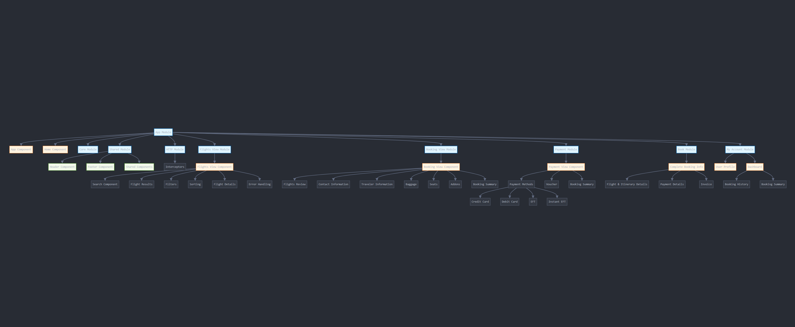

# b2c-website

This project has been upgraded to **Angular 18.2.x** and now requires **Node.js 20.x** to function properly.

## 🧰 Prerequisites

- **Node.js:** v20.x () , recommended 20.18.3
- **npm:** Comes with Node 20, usually v10+

To verify:
```bash
node -v
npm -v
```


## 📦 Re-installing All Dependencies

If you're working with a fresh clone or after updating Angular:

```bash
rm -rf node_modules package-lock.json
npm cache clean --force
npm install --legacy-peer-deps
```

⚠️ Use --legacy-peer-deps to avoid dependency resolution errors that might occur due to stricter peer dependency handling in newer npm versions.


## 📥 Installing New Dependencies
When installing new packages, you may need to use either --force or --legacy-peer-deps if you encounter peer dependency errors.


```bash
npm install some-package --legacy-peer-deps
# or
npm install some-package --force
```

## 🛠️ Building the Project
To build the project for production:

```bash
npm run env -s
npx ng build --configuration production --aot
```

## ▶️ Running the Project

To run the app locally (development mode):

```bash
npx ng serve
```
Then open http://localhost:4200 in your browser.


## 🧪 GitHub CI/CD Build Snippet
Below is an example CI step for building the B2C Angular 18 app:

```yaml
# Build and B2C app
- name: Clean dependencies
  run: rm -rf node_modules package-lock.json && npm cache clean --force

- name: Run npm install
  working-directory: ./b2c-app
  run: npm install --legacy-peer-deps

- name: Run Build - B2C App
  working-directory: ./b2c-app
  run: npm run env -s && npx ng build --configuration production --aot

```

## 💬 Notes
This project was upgraded from Angular 10 to Angular 18.2. Be cautious of older third-party libraries that may not support Angular 18 yet.

Always prefer using npx for Angular CLI commands to ensure the locally installed version is used.


# -- legacy documentation --


This project was generated with [Angular CLI](https://github.com/angular/angular-cli) version 10.1.4.

# b2c-app

Travelstart B2C Website

# Flight Booking Website Architecture

Here is the architecture diagram for the flight booking application:




b2c-app/                          # Root Directory
│── src/                          # Main source code
│   │── app/                      # Angular application root
│   │   │── core/                 # Core services (Auth, API calls, Logging)
│   │   │── shared/               # Reusable components (modals, buttons, notifications)
│   │   │── modules/              # Feature-specific modules
│   │   │   │── flights-view/     # Flight search, results, filters
│   │   │   │── booking-view/     # Passenger details, seat selection
│   │   │   │── payments-view/         # Payment gateway integration
│   │   │   │── book/             # Final confirmation page
│   │   │   │── my-account/       # User dashboard, past bookings
│   │   │── assets/               # Static assets (logos, icons, config)
│   │   │── environments/         # Config files for different environments
│   │── styles/                   # Global SCSS styles
│   │── index.html                # Main HTML entry file
│   │── main.ts                   # Bootstrap file
│── angular.json                  # Angular CLI configuration
│── package.json                  # Dependencies and scripts
│── README.md                      # Project documentation
│── .gitignore                     # Git ignored files


## Overview

This repository contains the source code for a **flight booking website** developed using **Angular**. The application allows users to search for flights, review flight details, enter booking information, make payments, and view completed bookings. The flow is divided into multiple modules, each handling a specific part of the booking process.

## Architecture Overview

The booking flow is divided into four key stages:

1. **Search**
2. **Price**
3. **Payment**
4. **Book**

Each step corresponds to a specific Angular module, helping to organize the code and improve maintainability. Here's a breakdown of the architecture:

---

### 1. App Module

- **Components**:
  - `AppComponent`: Root component of the entire application. Manages global elements like layout, routing, and services.
  - `HomeComponent`: The landing page where users can initiate flight searches.

**Flow**:
When the user visits the website, they land on the `HomeComponent`, which triggers the start of the booking flow by capturing travel details such as destination, dates, and passengers. Upon submitting a search request, the application navigates to the **Flights-View Module**.

---

### 2. Flights-View Module

- **Components**:
  - `FlightsViewComponent` (Parent component)
  - `SearchComponent`: Handles user input for travel details.
  - `FlightsResultsComponent`: Displays flight search results.
  - `FiltersComponent`: Allows users to filter the flight search results.
  - `SortingComponent`: Provides sorting options such as price or duration.
  - `FlightDetailsComponent`: Displays details of a selected flight.
  - `ErrorHandlingComponent`: Manages any errors during the search process.

**Flow**:
Users submit their search request via the `SearchComponent`. The `FlightsResultsComponent` displays matching flight results, and users can filter and sort flights using `FiltersComponent` and `SortingComponent`. When a flight is selected, the `FlightDetailsComponent` shows more detailed information. Errors encountered during this flow are handled by the `ErrorHandlingComponent`.

---

### 3. Booking-View Module

- **Components**:
  - `BookingViewComponent` (Parent component)
  - `FlightsReviewComponent`: Allows users to review their selected flight.
  - `ContactInformationComponent`: Collects user contact details.
  - `TravelerInformationComponent`: Collects traveler details like name and passport info.
  - `BaggageComponent`: Enables selection of baggage options.
  - `SeatsComponent`: Allows users to select their seats.
  - `AddonsComponent`: Offers optional services such as insurance.
  - `BookingSummaryComponent`: Displays a summary of the selected services and total price.

**Flow**:
Once a flight is selected, the user is directed to the `BookingViewComponent` to enter contact, traveler, and additional information (e.g., baggage, seats). The `BookingSummaryComponent` reviews all details before moving on to payment.

---

### 4. Payments Module

- **Components**:
  - `PaymentViewComponent` (Parent component)
  - `PaymentMethodsComponent`: Provides payment options (debit/credit card, EFT, vouchers).
  - `VoucherComponent`: Allows users to apply discount vouchers.
  - `BookingSummaryComponent`: Reviews the total cost and confirms the payment details before submission.

**Flow**:
Users select their payment method through the `PaymentMethodsComponent` and apply any vouchers via the `VoucherComponent`. The final cost is reviewed in the `BookingSummaryComponent` before proceeding with the payment process.

---

### 5. Book Module

- **Components**:
  - `CompleteBookingInformationComponent`: Shows the final booking confirmation details, including flight and itinerary details, payment confirmation, and the invoice.

**Flow**:
Once payment is successfully processed, the user is presented with complete booking information and the option to download or email the invoice. This completes the booking flow.

---

### 6. My-Account Module (Independent)

- **Components**:
  - `UserProfileComponent`: Manages user profile details (e.g., name, email).
  - `DashboardComponent`: Lists all past bookings made by the user.
  - `BookingSummaryComponent`: Displays details of a selected booking from the dashboard.

**Flow**:
This module is independent of the booking flow. Users can access their profile and booking history via the `DashboardComponent`.

---

### 7. Shared Module

- **Components**:
  - `HeaderComponent`: A reusable header used across the application.
  - `FooterComponent`: A reusable footer.
  - Other shared components (e.g., modals, notifications) used in various modules.

---

### 8. HTTP Module

- **Purpose**:
  Handles all HTTP requests and responses. Uses interceptors for tasks like adding authentication tokens and handling errors globally.

**Flow**:
Each module (e.g., **Flights-View Module** or **Payments Module**) that requires data from the backend communicates through the **HTTP Module**, which manages requests and responses, adds authentication, and handles errors.

---

### 9. Core Module

- **Purpose**:
  Provides core services (e.g., authentication, logging, API services) used throughout the application.

---

## Booking Flow Summary

1. **User Entry**: Users start at the `HomeComponent` to initiate the flight search.
2. **Flight Search**: The **Flights-View Module** handles search results and filtering.
3. **Flight Selection**: The user selects a flight and reviews details in the **Booking-View Module**.
4. **Payment**: The user makes a payment through the **Payments Module**.
5. **Booking Confirmation**: The final booking information is displayed in the **Book Module**.

---

## Modules Overview

- **App Module**: Main entry point of the application.
- **Flights-View Module**: Manages the flight search, filter, and results.
- **Booking-View Module**: Handles flight review, traveler information, and baggage.
- **Payments Module**: Manages payment methods and final booking confirmation.
- **Book Module**: Displays final booking information and invoice.
- **My-Account Module**: Independent module for user profiles and booking history.
- **Shared Module**: Contains reusable components like headers and footers.
- **HTTP Module**: Manages API requests and responses.
- **Core Module**: Provides global services and utilities.

---

## Technologies Used

- **Angular 10**: Frontend framework for building the application.
- **SCSS**: For styling components.
- **Angular Material**: UI component library for responsive design.
- **Bootstrap**: CSS framework for layout and responsiveness.
- **Font Awesome**: Icon library for including icons in the UI.
- **Amazon S3**: Static asset hosting for images and JavaScript files.

# Local setup

clone this repo: https://github.com/travelstart/b2c-website
then

- cd b2c-app

- npm install

- npm run start

once it is running: localhost:4200

To test different markets and point it to different environments you can install a header modifier like this: https://modheader.com/


## Prerequisites

Before you begin, ensure you have met the following requirements:

- Node.js: [14.20.0](https://nodejs.org/)
- npm: Ensure npm is installed with your Node.js version.

## Development server

Run `npm run start` for a dev server. Navigate to `http://localhost:4200/`. The app will automatically reload if you change any of the source files.

## Code scaffolding

Run `ng generate component component-name` to generate a new component. You can also use `ng generate directive|pipe|service|class|guard|interface|enum|module`.

## Build

Run `npm run start:prod` to build the project. The build artifacts will be stored in the `dist/` directory. Use the `--prod` flag for a production build.

## Running unit tests

Run `ng test` to execute the unit tests via [Karma](https://karma-runner.github.io).

## Running end-to-end tests

Run `ng e2e` to execute the end-to-end tests via [Protractor](http://www.protractortest.org/).

## Further help

To get more help on the Angular CLI use `ng help` or go check out the [Angular CLI README](https://github.com/angular/angular-cli/blob/master/README.md).

## Remove or Unregister the Service Worker

To unregister the service worker in your Angular app, you can do the following:In your app.module.ts 
imports: [
    ServiceWorkerModule.register('ngsw-worker.js', { enabled: false }) and Remove the PWA Configuration from angular.json:

     "serviceWorker": true, // Remove or set to false
     "ngswConfigPath": "ngsw-config.json", // Remove or comment out ngswConfigPath

## added these in angular.json file

  "src/robots.txt",
  "src/manifest.webmanifest",  #this one in angular.json file under assets
  "src/assets",

## place this in index file to enable PWA
  # rel="manifest" href="manifest.webmanifest" />

  [](https://sonarcloud.io/dashboard?id=travelstart_b2c-website)


## Secure Token & Secret Key Handling in Angular + Node (SSR) Architecture

Angular (no secrets)
   |
   |  [Standard HTTP request]
   ▼
Node.js (Express SSR / Proxy)
   |
   |  ➕ Adds server-only secrets (from .env or memory)
   ▼
Backend (expects API key/token in header/payload)


  # Below is a summary of the implementation:
    Objectives
      Prevent exposure of sensitive tokens in the browser.
      Use HttpOnly cookies to store tokens securely on the Node server.
      middleware on the Node server to bridge Angular and the backend.
      Comply with SSR requirements.

  # Run Everything locally
    npm run serve:dev:ssr

  # Or if debugging:
    npm run serve:debug:ssr
